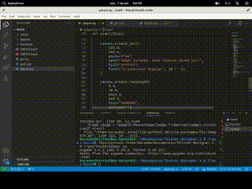

<h1 align="center">
  Bem vindo ao Open Voice
</h1>

<h3>No Open Voice acreditamos que a tecnologia e o meio ambiente podem andar de mãos dadas. Nosso processo inovador transforma componentes de hardware descartados em sofisticados sistemas de karaokê, permitindo que você se divirta enquanto ajuda o planeta.</h3>

<h1 align="center">
  Apresentação
</h1>

  

<h1>Requisitos</h1>
<h4>Python 3.10</h4> 
<h4>4GB de Ram</h4>
<h4>50MB de espaço para o sistema base(Aumentará conforme a adição das musicas)</h4>

<h1>Teclas de Atalho</h1>
<h4>F12 - Desliga o computador ou Sai da aplicação.</h4>
<h4>Esc - Fecha o player e volta para a tela principal.</h4>
